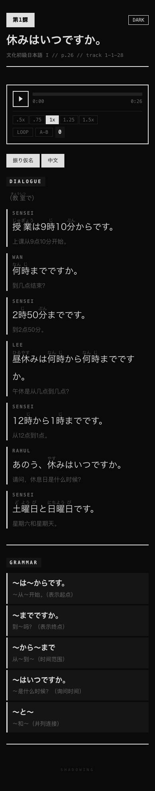
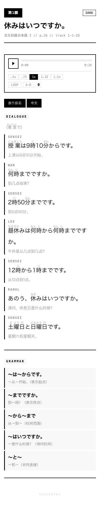
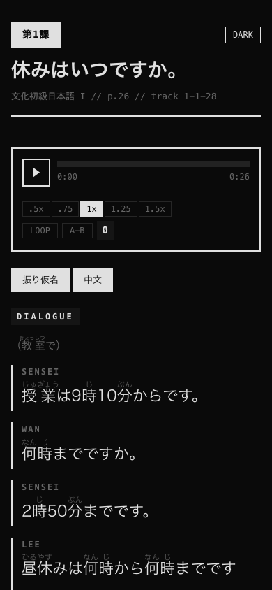
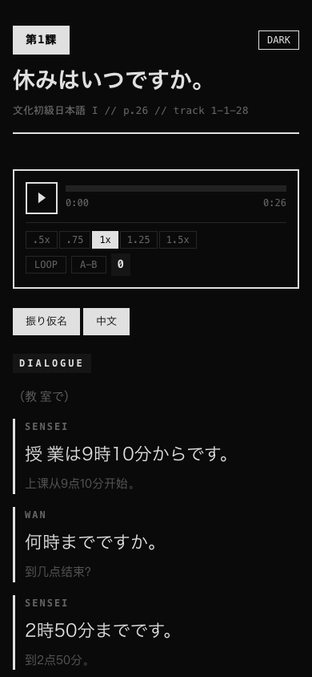

# JP Shadowing - 日语影子跟读

基于《文化初級日本語 I》的影子跟读（シャドーイング）练习工具。

每课生成一个独立的 HTML 页面，包含对话文本、注音、中文翻译和内置音频播放器，打开即用，无需安装。

## 页面功能

  
  

### 音频播放器

- **播放/暂停** — 点击播放按钮
- **进度拖拽** — 点击或拖动进度条跳转
- **速度调节** — 0.5x / 0.75x / 1x / 1.25x / 1.5x，慢速精听或快速挑战
- **循环播放 (LOOP)** — 全文无限循环，适合反复跟读
- **A-B 复读** — 点击进度条设定 A、B 两点，自动区间循环，攻克难句
- **播放计数** — 自动记录累计播放次数，持久化存储

### 内容切换

  
  

- **振り仮名** — 显示/隐藏汉字上方的假名注音，测试汉字认读
- **中文** — 显示/隐藏中文翻译，挑战纯日文理解

### 其他

- **明暗主题** — 右上角一键切换 Dark / Light 模式
- **移动端适配** — 手机上完美显示，随时随地练习
- **离线可用** — 纯静态 HTML，下载后无需网络

## 练习方法

1. **第一遍** — 开启振り仮名和中文，0.75x 慢速播放，熟悉内容
2. **第二遍** — 关闭中文，1x 正常速度，跟着音频同步朗读（影子跟读）
3. **第三遍** — 关闭振り仮名，专注听力和汉字认读
4. **难句攻克** — 用 A-B 复读锁定不熟练的句子，反复跟读直到流畅

## 课程目录

### 第1課

| # | 本文 | 在线练习 |
|---|------|---------|
| L01-1 | 私はワン・シューミンです。 | [开始练习 →](https://www.myvibe.so/xwgu007/jp-shadow-reading-lesson-01) |
| L01-2 | ワンさんは大学生ですか。 | [开始练习 →](https://www.myvibe.so/xwgu007/jp-shadow-reading-lesson-02) |
| L01-3 | 休みはいつですか。 | [开始练习 →](https://www.myvibe.so/xwgu007/jp-shadow-reading-lesson-03) |

### 第2課

| # | 本文 | 在线练习 |
|---|------|---------|
| L02-1 | 吉田良子さんの一日 | [开始练习 →](https://www.myvibe.so/xwgu007/jp-shadow-reading-lesson-04) |
| L02-2 | 昨日、何をしましたか。 | [开始练习 →](https://www.myvibe.so/xwgu007/jp-shadow-reading-lesson-05) |
